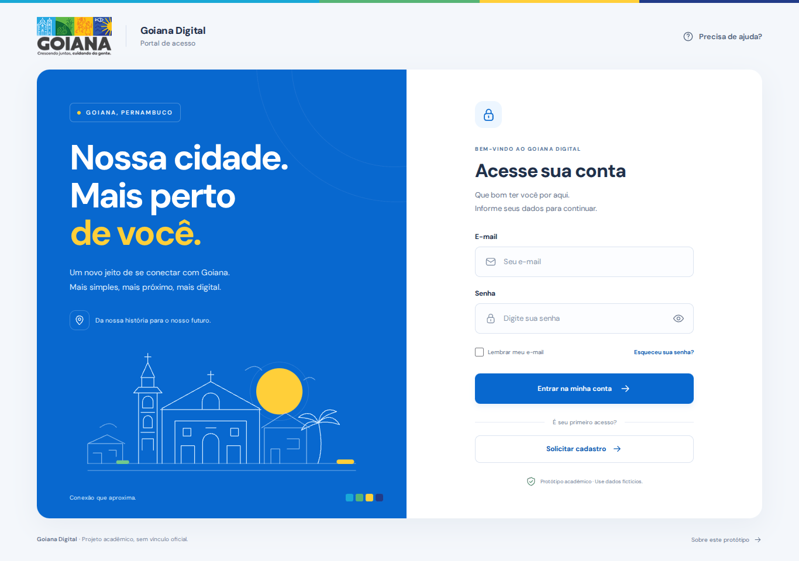

# Goiana Login — React

**[Abrir a tela de login online](https://wesleyttiago.github.io/goiana-login-react/)**

Página pública hospedada no GitHub Pages.

Tela de login responsiva, desenvolvida em **React + Vite**, com uma identidade visual inspirada no portal da Prefeitura de Goiana, Pernambuco. Projeto acadêmico, sem vínculo com o município.



<details>
<summary>Ver a versão para celular</summary>
<br />

</details>

## Executar

Instale o Node.js 22.12 ou superior. Na pasta do projeto:

```bash
npm ci
npm run dev
```

Abra o endereço informado no terminal, normalmente `http://localhost:5173`.

Para gerar e conferir a versão de produção:

```bash
npm run build
npm run preview
```

## O que está pronto

- Layout para computador e celular.
- Campos de e-mail e senha, com validação e foco no primeiro erro.
- Mostrar ou ocultar senha e aviso de Caps Lock.
- Opção de lembrar **somente o e-mail**, no navegador.
- Janelas de ajuda, recuperação de senha, primeiro acesso e informações do protótipo.
- Navegação por teclado, rótulos acessíveis e respeito à preferência por menos animações.
- Logo e fonte disponíveis localmente, sem depender de uma CDN para renderizar a interface.

## Autenticação

Este projeto entrega a **tela de login**. Ainda não existe servidor, banco de dados ou autenticação. Use dados fictícios ao testar. O botão de entrar informa que o acesso real ainda não está disponível; nenhum dado é enviado e a senha nunca é salva.

O componente `LoginForm` recebe uma função opcional `onLogin`. Quando houver um servidor, passe uma função que chame sua API:

```jsx
<LoginForm
  onOpenDialog={setDialog}
  onLogin={async ({ email, password }) => {
    // Chame a API do seu sistema e trate a navegação após autenticar.
    // Se a API rejeitar o acesso, lance um erro para exibir o aviso da tela.
  }}
/>
```

A função deve resolver somente depois de autenticar de fato. O componente desabilita o envio enquanto aguarda e apresenta uma mensagem genérica em caso de erro. Não coloque credenciais ou regras de autenticação no código do navegador.

## Arquivos principais

| Arquivo | Responsabilidade |
| --- | --- |
| `src/App.jsx` | Estrutura da página e controle das janelas |
| `src/components/LoginForm.jsx` | Campos, validação e integração futura com a API |
| `src/components/SupportDialog.jsx` | Janelas de ajuda e informações |
| `src/components/CityIllustration.jsx` | Ilustração em SVG |
| `src/styles.css` | Cores, tipografia e estilos responsivos |
| `src/assets/goiana-logo.png` | Marca usada como referência visual |

Para ajustar a identidade, comece pelas variáveis de cor no início de `src/styles.css`. Para alterar os textos, edite `src/App.jsx` e `src/components/SupportDialog.jsx`.

## Referências visuais

O portal oficial consultado foi <https://www.goiana.pe.gov.br/portal/>. A marca pertence à Prefeitura de Goiana e é usada aqui como referência para estudo; isso não representa endosso oficial. A ilustração histórica é autoral e não pretende reproduzir um monumento específico. A fonte DM Sans é distribuída pelo pacote Fontsource com sua licença própria.

A configuração `base: './'` permite servir o build em uma subpasta. O workflow `.github/workflows/deploy.yml` publica automaticamente no GitHub Pages a cada alteração na branch `main`, usando a base `/goiana-login-react/`.
